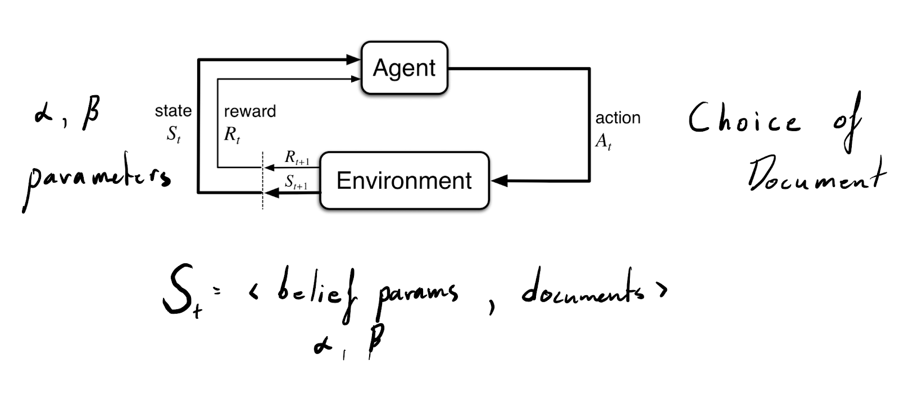
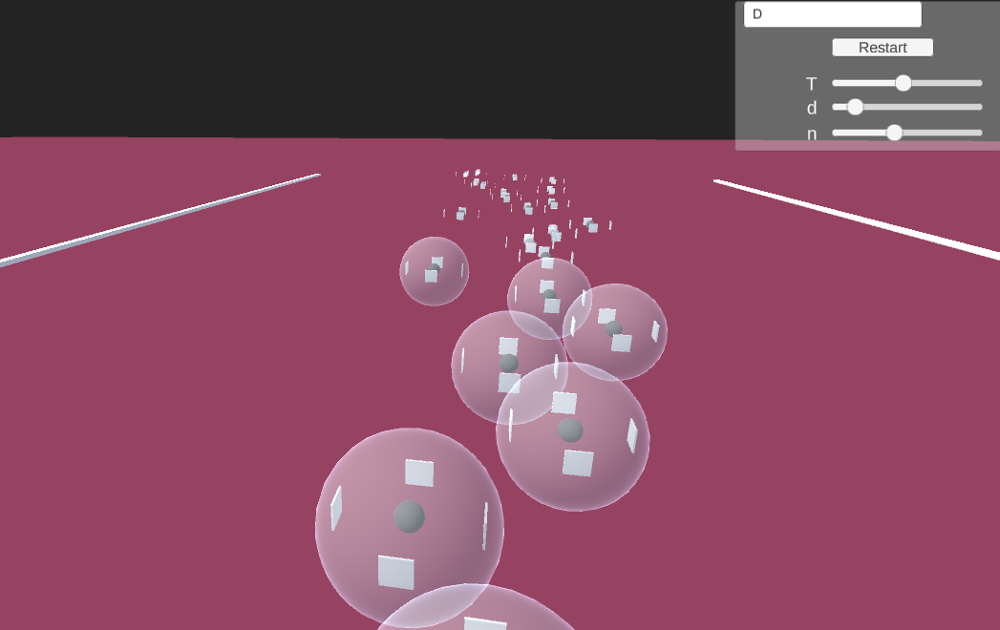

# rec-emergence
Standing for: Emergence by Recommendation Systems

What occurs to our individual beliefs when we throw screens and Twitter, YouTube, and Instagram onto human society? 

Can the recommendation algorithms embodied by such social media platforms be simulated? 

Here we look to model belief based multi-agent interaction within recommendation information environments using Reinforcement Learning (RL) policies and Collaborative Filtering (CF) in tandem. Interaction between agents must be done through the medium of a corpus of posts, analogous to items that appear in social media feeds (images, news articles, etc.). This is implemented and visualized using Unity 3D. 

Agents hold belief distributions (parameterized by two floats), act by choosing a document in its environment, recieve feedback, and continue this interplay through time with other agents: 

An agent surrounded by documents to consume, akin to online social media environments. Interaction between agents occurs through the recommendation system as a proxy.

May be cloned and run with Unity 2019.2.5f1 for guaranteed stability.

## (1) Single Dimension Information Environments
(Branch 'rylan', scene main)

**Parameters and the UI**
n :  number of agents

d :  number of documents per agent 

T :  time cap, an integer

r : max number of other agents used for CF

'D' or 'F' : agent policy, (D)iversity or (F)amiliarity

Must press restart to see changed parameters realized. This begins a new simulation. Positions in the space reflect agent belief distribution.

## (2) Multidimensional Information Environments
(Branch 'main', scene xxx)
